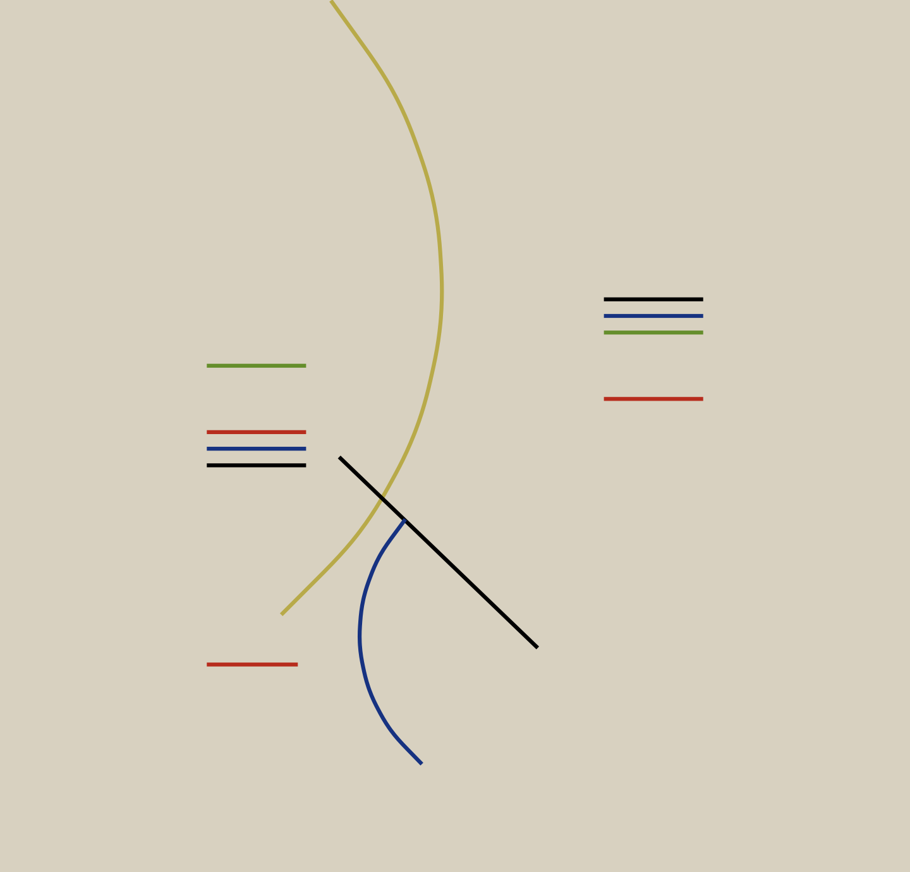

# art_recreations
My contributions to [#RecreationThursday](https://github.com/sharlagelfand/RecreationThursday), a social data visualization project to recreate (or remix) existing art pieces

|  Piece | Original | Recreation / Remix | Code |
| --- | ------- | ------- | ---- |
| [Alfredo Hilto Curves and Straight Series](https://www.moma.org/collection/works/205953) 1948 |  |  | [Link](https://github.com/kkakey/art_recreations/blob/main/2021-06-03-Alfredo_Hlito/2021-06-03-Alfredo_Hlito.Rmd)
| [Edna Andrade Twilight Waves](https://www.locksgallery.com/exhibitions/edna-andrade-symmetries#2) 1973 |  |  | [Link](https://github.com/kkakey/art_recreations/blob/main/2021-06-17-Edna_Andrade/2021-06-17-Edna_Andrade.Rmd)
